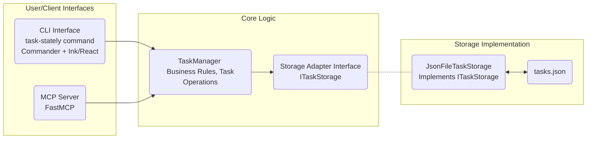

# task-stately

A task management tool with CLI and MCP interfaces, designed for efficient workflow management.

## Goal

To create a robust task management tool ("task-stately") featuring:

- An interactive Command Line Interface (CLI) built with Ink/React.
- A Model Control Protocol (MCP) interface for programmatic access (e.g., by AI assistants).
- A flexible storage system using an adapter pattern, initially implemented with a single JSON file (`tasks.json`).

## Architecture Overview

The architecture emphasizes separation of concerns for better testability and extensibility.



**Explanation:**

1.  **Interfaces (CLI & MCP):** Entry points for users and clients. They parse input, invoke core logic, and present results.
2.  **Core Logic (TaskManager, Storage Interface):** Contains business rules. `TaskManager` orchestrates operations, relying on the `ITaskStorage` interface for data persistence, decoupling it from the specific storage mechanism.
3.  **Storage Implementation (JsonFileTaskStorage, tasks.json):** Handles data persistence. `JsonFileTaskStorage` implements `ITaskStorage` using a `tasks.json` file.

For more details, see `context/high-level-architect.md`.

## Tech Stack

- **Language:** TypeScript
- **Runtime:** Node.js (LTS)
- **Package Manager:** pnpm
- **CLI Framework:** Commander.js (Parsing) + Ink/React (UI Rendering)
- **MCP Framework:** FastMCP
- **Validation:** Zod
- **Testing:** Vitest
- **Build Tool:** tsup (+ tsc for type checking)
- **Code Quality:** ESLint + Prettier

## Folder Structure

The project follows a structure organized by feature/layer:

```
task-stately/
├── .gitignore
├── package.json
├── tsconfig.json
├── tsup.config.ts
├── vitest.config.ts
├── README.md
├── tasks.json          # Default task data file
│
├── src/
│   ├── types/          # Core shared types (Zod schemas)
│   ├── core/           # Core business logic (TaskManager, Storage Interface)
│   │   └── storage/    # Storage implementations (JsonFileTaskStorage)
│   ├── cli/            # CLI specific code (Commander setup, Ink components)
│   │   ├── commands/   # CLI command handlers
│   │   └── components/ # Ink/React components
│   ├── mcp/            # MCP Server specific code (FastMCP setup, tools)
│   │   └── tools/      # MCP tool implementations
│   └── common/         # Shared utilities (Optional)
│
└── dist/               # Compiled JavaScript output
```

For more details, see `context/high-level-architect.md`.

## Documentation

For detailed information on usage, commands, and components, please refer to the [docs/](docs/) directory:

- [User Guide (Commands)](docs/4_user_guide.md)

## Setup & Installation

1.  **Prerequisites:** Node.js (LTS) and pnpm.
2.  **Clone the repository:**
    ```bash
    git clone <repository-url>
    cd task-stately
    ```
3.  **Install dependencies:**
    ```bash
    pnpm install
    ```
4.  **Initialize Task Storage:** Run the `init` command to create the `tasks.json` file if it doesn't exist.
    ```bash
    pnpm build # Ensure the CLI is built first
    node dist/cli/index.js init
    # Or, if linked globally (see Development section):
    # task-stately init
    ```

## Usage (CLI)

The primary way to interact with `task-stately` is through its CLI.

_(Note: Ensure the project is built (`pnpm build`) before running commands directly with `node dist/cli/index.js ...` or link it globally for easier access.)_

**Basic Commands:**

- **Initialize:** Creates the `tasks.json` storage file if it doesn't exist.
  ```bash
  task-stately init
  ```
- **Add Task:** Adds a new task. You can provide details via flags or use the interactive mode.

  ```bash
  # Add task using flags
  task-stately add --title "Implement feature X" --description "Details..." --priority high

  # Add task interactively (prompts for details)
  task-stately add --interactive

  # Add task (will trigger interactive mode if required options like --title are missing)
  task-stately add
  ```

- **List Tasks:** Shows a list of all tasks.
  ```bash
  task-stately list
  # Filter by status:
  task-stately list --status todo
  ```
- **Show Task:** Displays details for a specific task by ID.
  ```bash
  task-stately show <task-id>
  ```
- **Update Task:** Modifies an existing task by ID. You can provide updates via flags or use the interactive mode.

  ```bash
  # Update task using flags
  task-stately update <task-id> --status in-progress --description "Updated details..."

  # Update task interactively (prompts for fields to update)
  task-stately update <task-id> --interactive

  # Update task (will trigger interactive mode if no update options are provided)
  task-stately update <task-id>
  ```

- **Delete Task:** Removes a task by ID.
  ```bash
  task-stately delete <task-id>
  ```
- **Manage Dependencies:** Add or remove dependencies between tasks.
  ```bash
  task-stately dependency add --taskId <task-id> --dependsOn <dependency-id>
  task-stately dependency remove --taskId <task-id> --dependsOn <dependency-id>
  ```
- **Manage Subtasks:** Add or remove subtasks.
  ```bash
  task-stately subtask add --parentId <parent-id> --title "Subtask title"
  task-stately subtask remove --parentId <parent-id> --subtaskId <subtask-id>
  ```

Run `task-stately --help` or `task-stately <command> --help` for more options.

## Development

Common scripts for development:

- **Build:** Compile TypeScript to JavaScript using tsup.
  ```bash
  pnpm build
  ```
- **Watch & Build:** Automatically rebuild on file changes.
  ```bash
  pnpm dev
  ```
- **Type Check:** Check for TypeScript errors without compiling.
  ```bash
  pnpm typecheck
  ```
- **Lint:** Check code style using ESLint.
  ```bash
  pnpm lint
  ```
- **Lint & Fix:** Automatically fix linting errors.
  ```bash
  pnpm lint:fix
  ```
- **Format:** Format code using Prettier.
  ```bash
  pnpm format
  ```
- **Test:** Run unit and integration tests using Vitest.
  ```bash
  pnpm test
  ```
- **Test (Watch):** Run tests in watch mode.
  ```bash
  pnpm test:watch
  ```
- **Test Coverage:** Run tests and generate a coverage report.
  ```bash
  pnpm coverage
  ```
- **Validate:** Run lint, type check, and tests together.
  ```bash
  pnpm validate # Assumes a script like: "validate": "pnpm lint && pnpm typecheck && pnpm test"
  ```

**Linking for CLI Development:**

To use the `task-stately` command globally during development:

1.  Build the project: `pnpm build`
2.  Link the package: `pnpm link --global`
3.  Now you can run `task-stately <command>` directly in your terminal.

## MCP Server

The MCP (Management Control Panel) server provides a programmatic interface for interacting with the Task Manager, primarily designed for use by external tools or agents like AI assistants.

### Starting the Server

To start the MCP server, run the following command:

```bash
pnpm run mcp
```

This will start the server, typically listening on a predefined port (check server startup logs for details).

### Available Tools

The server exposes several tools (functions) for task management. These correspond to the modules found in `src/mcp/tools/`:

| Tool Name              | Function                                      |
| ---------------------- | --------------------------------------------- |
| `init`                 | Initializes the task storage if not present.  |
| `getTask`              | Retrieves details for a specific task by ID.  |
| `listTasks`            | Lists all existing tasks.                     |
| `addTask`              | Adds a new task.                              |
| `addMultipleTasks`     | Adds multiple tasks in a single operation.    |
| `updateTask`           | Updates an existing task's properties.        |
| `deleteTask`           | Deletes a task by ID.                         |
| `addTaskDependency`    | Adds a dependency relationship between tasks. |
| `removeTaskDependency` | Removes a dependency relationship.            |

## Project Status

- **Phase 1: Project Setup & Foundation:** ✅ Complete
- **Phase 2: Core Logic & Storage Implementation:** ✅ Complete
- **Phase 3: CLI Implementation (Ink/React):** ✅ Complete
- **Phase 4: MCP Server Implementation:** ✅ Complete
- **Phase 5: Refinement, Documentation & Packaging:** ⏳ Planned
