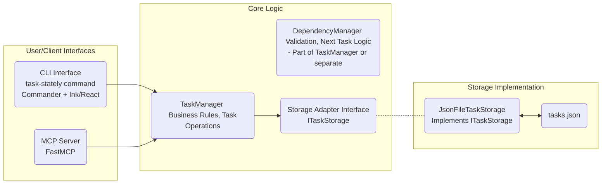

#Outline the high-level architecture and propose a folder structure for **task-stately**.

**High-Level Architecture**

The architecture emphasizes separation of concerns, making it easier to manage, test, and potentially extend (e.g., adding different storage backends or UI frontends later).



**Explanation:**

1.  **Interfaces (CLI & MCP):** These are the entry points for users and programmatic clients (like AI assistants). They are responsible for parsing input, invoking the core logic, and presenting the results. They should contain minimal business logic themselves.
2.  **Core Logic (TaskManager, DependencyManager, Storage Interface):** This layer contains the application's business rules.
    - `TaskManager` orchestrates operations (create, update, find tasks, manage subtasks, etc.). It understands _what_ needs to happen.
    - `DependencyManager` (could be part of `TaskManager` or separate) handles the specific rules around task dependencies.
    - Crucially, the core logic depends only on the `ITaskStorage` **interface**, not a specific implementation. This makes it decoupled from the actual storage mechanism.
3.  **Storage Implementation (JsonFileTaskStorage, tasks.json):** This layer handles the _how_ of data persistence.
    - `JsonFileTaskStorage` implements the `ITaskStorage` interface, translating the required operations into reading from and writing to the `tasks.json` file.
    - `tasks.json` is the actual data file.

**Proposed Folder Structure**

This structure organizes code by feature/layer, follows common TypeScript project conventions, and accommodates the chosen stack.

```
task-stately/
├── .git/
├── .gitignore
├── .prettierignore
├── .prettierrc.json
├── .eslintrc.cjs             # Or .eslintrc.json, etc.
├── node_modules/
├── package.json
├── tsconfig.json
├── tsup.config.ts            # Optional, for tsup configuration
├── vitest.config.ts          # Optional, for Vitest configuration
├── README.md
├── tasks.json                # Default location for task data (can be configured)
│
├── src/                      # Source code root
│   ├── types/                # Core shared types and Zod schemas
│   │   ├── task.ts           # TaskSchema, Task type, SubtaskSchema, Subtask type
│   │   └── index.ts          # Optional barrel file to re-export types
│   │
│   ├── core/                 # Core business logic, independent of UI/Network
│   │   ├── TaskManager.ts
│   │   ├── TaskManager.test.ts
│   │   ├── DependencyManager.ts    # Or integrate logic into TaskManager
│   │   ├── DependencyManager.test.ts
│   │   ├── storage/
│   │   │   ├── ITaskStorage.ts     # Storage adapter interface
│   │   │   ├── JsonFileTaskStorage.ts  # JSON implementation
│   │   │   └── JsonFileTaskStorage.test.ts
│   │   └── utils/              # Core utility functions (e.g., ID generation, date handling)
│   │
│   ├── cli/                  # Command-Line Interface specific code
│   │   ├── index.ts          # Entry point for the CLI (runs Commander)
│   │   ├── commands/         # Logic handlers for each CLI command
│   │   │   ├── list.ts
│   │   │   ├── add.ts
│   │   │   ├── show.ts
│   │   │   └── ...           # Handlers call TaskManager, then render Ink components
│   │   ├── components/       # Ink/React UI components
│   │   │   ├── TaskList.tsx
│   │   │   ├── TaskDetail.tsx
│   │   │   ├── StatusLabel.tsx
│   │   │   └── ...
│   │   └── utils/              # CLI specific utility functions (e.g., argument parsing helpers)
│   │
│   ├── mcp/                  # MCP Server specific code
│   │   ├── server.ts         # Entry point for the MCP server (runs FastMCP)
│   │   ├── tools/            # Implementations for each MCP tool
│   │   │   ├── getTask.ts
│   │   │   ├── listTasks.ts
│   │   │   ├── addTask.ts
│   │   │   └── ...           # Tool handlers call TaskManager, format MCP response
│   │   └── utils/              # MCP specific utility functions
│   │
│   └── common/               # (Optional) Truly shared utilities used by CLI, MCP, Core
│
└── dist/                     # Compiled JavaScript output (from tsup/tsc)
    ├── types/
    ├── core/
    ├── cli/
    ├── mcp/
    └── ...
```

**Key Points about Structure:**

- **`src/types`**: Central place for defining the core data structures (Task, Subtask) using Zod. Ensures consistency across the application.
- **`src/core`**: The heart of the application. It should not import anything from `src/cli` or `src/mcp`. Contains the `ITaskStorage` interface definition.
- **`src/core/storage`**: Contains the actual storage implementation(s). Only this part knows about `tasks.json`.
- **`src/cli`**: Contains everything related to the command-line interface, including Ink components and Commander setup. Imports from `src/core` and `src/types`.
- **`src/mcp`**: Contains everything related to the MCP server (FastMCP setup, tool definitions). Imports from `src/core` and `src/types`.
- **Tests (`*.test.ts`)**: Located alongside the files they test for easy discovery.
- **`dist/`**: Compiled output directory, ignored by Git. `package.json`'s `main`, `bin`, and `files` fields should point to appropriate files within `dist/`.

This structure provides a clear separation, making the project easier to navigate, test, and maintain as it grows.
