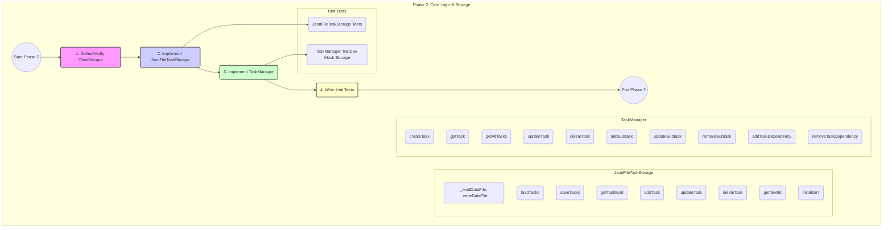

# Task-Stately: Phase 2 Detailed Plan

**Goal:** Build the non-UI, non-network parts of the task management system, including the storage adapter implementation for JSON files and the core business logic layer (`TaskManager`). Ensure this core is testable.

**Prerequisites:**

- Phase 1 (Project Setup & Foundation) is complete.
- Core types (`Task`, `Subtask`, Zod schemas) are defined in `src/types/task.ts`.
- Basic directory structure (`src/core`, `src/core/storage`, etc.) exists.

---

## Detailed Steps & Rationale

**1. Define Storage Interface (`src/core/storage/ITaskStorage.ts`):**

- **Action:** Create (or verify existence of) `src/core/storage/ITaskStorage.ts`.
- **Action:** Define the `ITaskStorage` interface with methods: `loadTasks`, `saveTasks`, `getTaskById`, `addTask`, `updateTask`, `deleteTask`, `getNextId`. Include optional `initialize` and `dispose` methods.
- **Action:** Define helper types `NewTaskData` (for `addTask`) and `UpdateTaskData` (for `updateTask`) based on the `Task` type, omitting generated/read-only fields.
- **Rationale:** Establishes a clear contract for how the core logic interacts with data persistence, allowing different storage backends (JSON, database, etc.) to be swapped later (Storage Adapter Pattern). _Note: This file might already exist from the previous interrupted step._

**2. Implement JSON Storage (`src/core/storage/JsonFileTaskStorage.ts`):**

- **Action:** Create `src/core/storage/JsonFileTaskStorage.ts`.
- **Action:** Import necessary modules: `fs/promises`, `path`, `ITaskStorage`, `Task`, `TasksFile`, `TasksFileSchema`, `NewTaskData`, `UpdateTaskData` from `@/types/task`.
- **Action:** Define class `JsonFileTaskStorage` implementing `ITaskStorage`.
- **Action:** Implement constructor: Accepts the JSON file path (e.g., `tasksFilePath: string`), defaulting to `'tasks.json'` relative to the project root. Store the absolute path.
- **Action:** Implement `_readDataFile(): Promise<TasksFile>` (private helper):
  - Reads file content using `fs.readFile(this.tasksFilePath, 'utf-8')`.
  - Handles `ENOENT` error (file not found) by returning a default structure: `{ meta: { schemaVersion: 1, lastId: '0' }, tasks: [] }`.
  - Parses JSON content using `JSON.parse()`.
  - Validates the parsed data using `TasksFileSchema.safeParse()`. If invalid, log error and throw or return default structure.
  - Returns the validated `TasksFile` data.
- **Action:** Implement `_writeDataFile(data: TasksFile): Promise<void>` (private helper):
  - Stringify data using `JSON.stringify(data, null, 2)` for pretty printing.
  - Write to file using `fs.writeFile(this.tasksFilePath, jsonData, 'utf-8')`. Consider atomic writes (write to temp file then rename) for robustness if needed later.
- **Action:** Implement `loadTasks(): Promise<Task[]>`:
  - Calls `_readDataFile()`.
  - Returns the `tasks` array from the result.
- **Action:** Implement `saveTasks(tasks: Task[]): Promise<void>`:
  - Calls `_readDataFile()` to get current metadata (`meta`).
  - Creates a new `TasksFile` object: `{ meta: currentMeta, tasks: tasks }`.
  - Calls `_writeDataFile()` with the new object.
- **Action:** Implement `getTaskById(id: string): Promise<Task | undefined>`:
  - Calls `loadTasks()`.
  - Uses `find()` on the result to locate the task by `id`.
- **Action:** Implement `getNextId(): Promise<string>`:
  - Calls `_readDataFile()` to get current metadata.
  - Parses `meta.lastId` to a number, increments it.
  - Returns the incremented number as a string. (Note: This ID is used by `addTask`, which is responsible for saving the updated `lastId`).
- **Action:** Implement `addTask(taskData: NewTaskData): Promise<Task>`:
  - Calls `_readDataFile()` to get current tasks and metadata.
  - Calls `getNextId()` _or_ reads `meta.lastId`, increments it, and prepares the new `meta.lastId`. Let's refine: Read `meta.lastId`, increment number, get `newId` string.
  - Creates the full `Task` object: `{ id: newId, ...taskData, createdAt: new Date().toISOString(), updatedAt: new Date().toISOString(), status: taskData.status ?? 'pending', subtasks: [] }`.
  - Adds the new task to the `tasks` array.
  - Updates the metadata: `{ ...currentMeta, lastId: newId }`.
  - Calls `_writeDataFile()` with the updated tasks and metadata.
  - Returns the newly created task object.
- **Action:** Implement `updateTask(id: string, updates: UpdateTaskData): Promise<Task>`:
  - Calls `_readDataFile()` to get current tasks and metadata.
  - Finds the index of the task with the given `id`. Throw an error if not found.
  - Creates the updated task object by merging `updates` and setting `updatedAt: new Date().toISOString()`. Ensure `id` and `createdAt` are not overwritten.
  - Replaces the task at the found index with the updated task.
  - Calls `_writeDataFile()` with the updated tasks and existing metadata.
  - Returns the updated task object.
- **Action:** Implement `deleteTask(id: string): Promise<boolean>`:
  - Calls `_readDataFile()` to get current tasks and metadata.
  - Filters the `tasks` array, removing the task with the matching `id`.
  - If the array length decreased, call `_writeDataFile()` with the filtered tasks and existing metadata, then return `true`.
  - Otherwise, return `false`.
- **Action:** (Optional) Implement `initialize(): Promise<void>`:
  - Get the directory path from `this.tasksFilePath`.
  - Use `fs.mkdir(dirPath, { recursive: true })` to ensure the directory exists.
- **Rationale:** Provides a concrete storage mechanism using a local JSON file. Handles file I/O, data validation using Zod schemas, ID generation (simple incrementing string), and basic CRUD operations.

**3. Implement TaskManager (`src/core/TaskManager.ts`):**

- **Action:** Create `src/core/TaskManager.ts`.
- **Action:** Import `ITaskStorage`, `Task`, `Subtask`, `NewTaskData`, `UpdateTaskData`, Zod schemas (`TaskSchema`, `SubtaskSchema`, etc.) from relevant paths (`@/core/storage/ITaskStorage`, `@/types/task`).
- **Action:** Define the `TaskManager` class.
- **Action:** Implement constructor: Accepts an `ITaskStorage` instance via dependency injection and stores it in a private readonly property (e.g., `private readonly storage: ITaskStorage`).
- **Action:** Implement `createTask(taskData: NewTaskData): Promise<Task>`:
  - _(Optional validation step using Zod if needed beyond type safety)_.
  - Calls `this.storage.addTask(taskData)`.
  - Returns the result.
- **Action:** Implement `getTask(id: string): Promise<Task | undefined>`:
  - Calls `this.storage.getTaskById(id)`.
  - Returns the result. (Consider if it should throw an error if not found, or let the caller handle `undefined`).
- **Action:** Implement `getAllTasks(): Promise<Task[]>`:
  - Calls `this.storage.loadTasks()`.
  - Returns the result.
- **Action:** Implement `updateTask(id: string, updates: UpdateTaskData): Promise<Task>`:
  - _(Optional validation of `updates` using Zod)_.
  - _(Future: Add business logic validation, e.g., status transitions)_.
  - Calls `this.storage.updateTask(id, updates)`.
  - Returns the result.
- **Action:** Implement `deleteTask(id: string): Promise<boolean>`:
  - _(Future: Add business logic, e.g., check dependencies before deleting)_.
  - Calls `this.storage.deleteTask(id)`.
  - Returns the result.
- **Action:** Implement `addSubtask(taskId: string, subtaskData: Omit<Subtask, 'id' | 'createdAt' | 'updatedAt'>): Promise<Subtask>`:
  - Calls `this.storage.getTaskById(taskId)`. Throw error if parent task not found.
  - Generates a unique subtask ID (e.g., `${taskId}.${parentTask.subtasks.length + 1}` or using a UUID library if preferred later).
  - Creates the new `Subtask` object with ID, provided data, and timestamps.
  - Creates an updated `subtasks` array for the parent.
  - Calls `this.storage.updateTask(taskId, { subtasks: updatedSubtasksArray })`.
  - Returns the newly created subtask.
- **Action:** Implement `updateSubtask(taskId: string, subtaskId: string, updates: Partial<Omit<Subtask, 'id' | 'createdAt' | 'updatedAt'>>): Promise<Subtask>`:
  - Calls `this.storage.getTaskById(taskId)`. Throw error if parent task not found.
  - Finds the index of the subtask by `subtaskId`. Throw error if not found.
  - Creates the updated subtask object by merging `updates` and setting `updatedAt`.
  - Creates an updated `subtasks` array for the parent.
  - Calls `this.storage.updateTask(taskId, { subtasks: updatedSubtasksArray })`.
  - Returns the updated subtask.
- **Action:** Implement `removeSubtask(taskId: string, subtaskId: string): Promise<boolean>`:
  - Calls `this.storage.getTaskById(taskId)`. Throw error if parent task not found.
  - Filters the `subtasks` array, removing the subtask with the matching `subtaskId`.
  - If the array length decreased, call `this.storage.updateTask(taskId, { subtasks: filteredSubtasksArray })` and return `true`.
  - Otherwise, return `false`.
- **Action:** Implement `addTaskDependency(taskId: string, dependencyId: string): Promise<Task>`:
  - Calls `this.storage.getTaskById(taskId)`. Throw error if task not found.
  - If `dependencyId` is not already in `task.dependencies` and `dependencyId !== taskId`, add it.
  - Calls `this.storage.updateTask(taskId, { dependencies: updatedDependenciesArray })`.
  - Returns the updated task.
- **Action:** Implement `removeTaskDependency(taskId: string, dependencyId: string): Promise<Task>`:
  - Calls `this.storage.getTaskById(taskId)`. Throw error if task not found.
  - Filters the `dependencies` array, removing `dependencyId`.
  - If the array changed, call `this.storage.updateTask(taskId, { dependencies: filteredDependenciesArray })`.
  - Returns the updated task (even if dependencies didn't change).
- **Rationale:** Centralizes the application's business logic, orchestrating actions through the storage interface. Keeps the core independent of specific storage details and UI concerns.

**4. Unit Testing:**

- **Action:** Create `src/core/storage/JsonFileTaskStorage.test.ts`.
- **Action:** Write tests for `JsonFileTaskStorage` using Vitest:
  - Setup: Use `memfs` or `fs.mkdtemp` in `beforeEach`/`afterEach` to create isolated file systems for tests.
  - Test cases: Cover loading (no file, valid file, invalid JSON, invalid schema), saving, adding, getting, updating, deleting tasks, and ID generation. Assert file content changes and return values.
- **Action:** Create `src/core/TaskManager.test.ts`.
- **Action:** Write tests for `TaskManager` using Vitest:
  - Setup: Use `vi.mock('@/core/storage/ITaskStorage')` (or the actual path to the interface/mock implementation) to mock the storage dependency. Create mock storage instance before each test.
  - Test cases: For each public method in `TaskManager`, verify that it calls the corresponding storage method with the correct arguments. Mock the return values of storage methods to test `TaskManager`'s handling of results. Assert the return values of `TaskManager` methods.
- **Rationale:** Ensures the reliability and correctness of both the storage implementation and the core business logic in isolation. Mocking the storage interface allows testing `TaskManager` without actual file I/O.

---

## Visual Plan (Mermaid)

---

## Actionable Subtasks

**Subtask 2.1: Define/Verify Storage Interface**

- **Action:** Ensure `src/core/storage/ITaskStorage.ts` exists and defines the `ITaskStorage` interface and helper types (`NewTaskData`, `UpdateTaskData`) as specified.
- **Outcome:** Storage contract defined.

**Subtask 2.2: Implement JSON Storage Class Structure**

- **Action:** Create `src/core/storage/JsonFileTaskStorage.ts`.
- **Action:** Define the `JsonFileTaskStorage` class implementing `ITaskStorage`.
- **Action:** Implement the constructor accepting the file path.
- **Action:** Implement private helper methods `_readDataFile` and `_writeDataFile` including file reading/writing, JSON parsing, Zod validation (`safeParse`), and error handling (file not found).
- **Outcome:** Basic structure for JSON storage implementation is in place.

**Subtask 2.3: Implement JSON Storage Read Methods**

- **Action:** Implement `loadTasks()` using `_readDataFile`.
- **Action:** Implement `getTaskById(id: string)` using `loadTasks`.
- **Action:** Implement `getNextId()` using `_readDataFile`.
- **Outcome:** Read operations for JSON storage are functional.

**Subtask 2.4: Implement JSON Storage Write Methods**

- **Action:** Implement `saveTasks(tasks: Task[])` using `_readDataFile` (for metadata) and `_writeDataFile`.
- **Action:** Implement `addTask(taskData: NewTaskData)` using `_readDataFile`, `getNextId`, creating the task object, and `_writeDataFile`.
- **Action:** Implement `updateTask(id: string, updates: UpdateTaskData)` using `_readDataFile`, finding/updating the task, and `_writeDataFile`.
- **Action:** Implement `deleteTask(id: string)` using `_readDataFile`, filtering tasks, and `_writeDataFile`.
- **Outcome:** Write operations for JSON storage are functional.

**Subtask 2.5: Implement TaskManager Class Structure**

- **Action:** Create `src/core/TaskManager.ts`.
- **Action:** Define the `TaskManager` class.
- **Action:** Implement the constructor accepting `ITaskStorage` via dependency injection.
- **Outcome:** Basic structure for the business logic layer is in place.

**Subtask 2.6: Implement TaskManager CRUD Methods**

- **Action:** Implement `createTask`, `getTask`, `getAllTasks`, `updateTask`, `deleteTask` by calling the corresponding methods on the injected storage instance.
- **Outcome:** Core task CRUD operations are available through the `TaskManager`.

**Subtask 2.7: Implement TaskManager Subtask Methods**

- **Action:** Implement `addSubtask`, `updateSubtask`, `removeSubtask` involving calls to `storage.getTaskById` and `storage.updateTask` to manage the parent task's `subtasks` array.
- **Outcome:** Subtask management logic is implemented.

**Subtask 2.8: Implement TaskManager Dependency Methods**

- **Action:** Implement `addTaskDependency` and `removeTaskDependency` involving calls to `storage.getTaskById` and `storage.updateTask` to manage the task's `dependencies` array.
- **Outcome:** Basic dependency management logic is implemented.

**Subtask 2.9: Write JSON Storage Unit Tests**

- **Action:** Create `src/core/storage/JsonFileTaskStorage.test.ts`.
- **Action:** Write Vitest tests covering all methods of `JsonFileTaskStorage`, using `memfs` or temporary files for isolation.
- **Outcome:** `JsonFileTaskStorage` implementation is verified.

**Subtask 2.10: Write TaskManager Unit Tests**

- **Action:** Create `src/core/TaskManager.test.ts`.
- **Action:** Write Vitest tests covering all methods of `TaskManager`, using `vi.mock` to mock the `ITaskStorage` dependency.
- **Outcome:** `TaskManager` business logic is verified in isolation.

---

**Phase 2 Overall Outcome:** A testable core library (`TaskManager` and `JsonFileTaskStorage`) capable of managing tasks (including subtasks and basic dependencies) via the storage adapter, completely independent of CLI or MCP interfaces.
