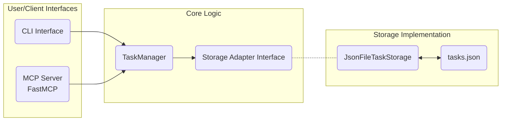

# Phase 4 Specification: MCP Server Implementation

## 1. Goal

To implement a Model Control Protocol (MCP) server using FastMCP that exposes the core functionalities of the `TaskManager` for programmatic interaction (e.g., by AI assistants or other services). This allows managing tasks without using the interactive CLI.

## 2. Architecture Integration

The MCP server will sit alongside the CLI as an interface to the `TaskManager`.



- The MCP server (`src/mcp/server.ts`) will instantiate `JsonFileTaskStorage` and `TaskManager`.
- It will define and register tools using FastMCP.
- Each tool handler (`src/mcp/tools/*.ts`) will parse input parameters, call the appropriate `TaskManager` method, and format the response according to MCP standards.

## 3. Required MCP Tools

Based on the existing CLI commands and core `TaskManager` capabilities, the following MCP tools are required:

| Tool Name              | Description                                                                                                   | Corresponding CLI Command(s) | TaskManager Method(s)                                      |
| :--------------------- | :------------------------------------------------------------------------------------------------------------ | :--------------------------- | :--------------------------------------------------------- |
| `getTask`              | Retrieves details for a specific task by ID.                                                                  | `show <id>`                  | `findTask`                                                 |
| `listTasks`            | Lists tasks, optionally filtering by status/type/dependencies.                                                | `list [--status]`            | `getAllTasks`, `findTask` (for dep titles)                 |
| `addTask`              | Adds a single new task, optionally linking to a parent & adding children.                                     | `add [--parent-id]`          | `createTask` (potentially multiple times)                  |
| `addMultipleTasks`     | Adds multiple tasks (each potentially with children) in batch, resolving dependencies between the main tasks. | (New - AI focused)           | `createTask` (multiple), `updateTask` (multiple, for deps) |
| `updateTask`           | Updates an existing task by ID (incl. parent link).                                                           | `update <id>`                | `updateTask`                                               |
| `deleteTask`           | Deletes a task by ID, optionally cascading.                                                                   | `delete <id>`                | `deleteTask`                                               |
| `addTaskDependency`    | Adds a dependency link between two tasks (using real IDs).                                                    | `dependency add`             | `addTaskDependency`                                        |
| `removeTaskDependency` | Removes a dependency link between two tasks (using real IDs).                                                 | `dependency remove`          | `removeTaskDependency`                                     |
| `init`                 | Initializes the task storage (e.g., creates `tasks.json` if needed).                                          | `init`                       | `storageAdapter.initialize()` (or similar mechanism)       |

## 4. Pseudocode Design

### 4.1. Server Setup (`src/mcp/server.ts`)

```typescript
// src/mcp/server.ts
import { FastMCP } from 'fastmcp';
import { JsonFileTaskStorage } from '../core/storage/JsonFileTaskStorage';
import { TaskManager } from '../core/TaskManager';

// Import tool definitions
import { getTaskTool } from './tools/getTask';
import { listTasksTool } from './tools/listTasks';
import { addTaskTool } from './tools/addTask'; // Single task add
import { addMultipleTasksTool } from './tools/addMultipleTasks'; // Batch task add
import { updateTaskTool } from './tools/updateTask';
import { deleteTaskTool } from './tools/deleteTask';
import { addTaskDependencyTool } from './tools/addTaskDependency';
import { removeTaskDependencyTool } from './tools/removeTaskDependency';
import { initTool } from './tools/init'; // Renamed import

// --- Initialization ---

// Create MCP Server instance
// TEST: Ensure server name and description are appropriate
// NOTE: TaskManager and StorageAdapter will be instantiated dynamically within each tool
//       using the 'projectRoot' parameter provided in the tool call.
const server = new FastMCP({
  name: 'task-stately-mcp',
  description: 'MCP Server for Task Stately task management tool.',
});

// --- Tool Registration ---

// Register each tool factory/definition
// TEST: Ensure all required tools are registered
server.addTool(getTaskTool());
server.addTool(listTasksTool());
server.addTool(addTaskTool()); // Keep single add
server.addTool(addMultipleTasksTool()); // Add batch add
server.addTool(updateTaskTool());
server.addTool(deleteTaskTool());
server.addTool(addTaskDependencyTool());
server.addTool(removeTaskDependencyTool());
server.addTool(initTool()); // Tool will handle storage instantiation

// --- Server Start ---

// Function to start the server (e.g., called from an executable script)
async function startServer() {
  try {
    // TEST: Ensure server starts correctly with stdio transport
    await server.start({ transportType: 'stdio' });
    console.log('Task Stately MCP Server started on stdio.');
  } catch (error) {
    // TEST: Ensure server startup errors are logged
    console.error('Failed to start MCP server:', error);
    process.exit(1);
  }
}

// Start the server if this script is run directly
if (require.main === module) {
  startServer();
}

export { server, startServer }; // Export for potential programmatic use or testing
```

### 4.2. Tool Example: `getTask` (`src/mcp/tools/getTask.ts`)

```typescript
// src/mcp/tools/getTask.ts
import { z } from 'zod';
import { TaskManager } from '../../core/TaskManager';
import { McpTool } from 'fastmcp'; // Assuming FastMCP exports a type like this
import { TaskNotFoundError } from '../../types/task'; // Assuming exported

// Define input schema using Zod
const GetTaskParamsSchema = z.object({
  id: z.string().min(1, { message: 'Task ID must be a non-empty string.' }),
  projectRoot: z
    .string()
    .describe('Absolute path to the project root directory on the client.'),
});

// Define the tool factory function
export const getTaskTool = (): McpTool => ({
  name: 'getTask',
  description: 'Retrieves details for a specific task by ID.',
  parameters: GetTaskParamsSchema, // Use Zod schema for validation

  // TEST: Ensure execute function is defined
  execute: async (params) => {
    // Parameters are already validated by FastMCP
    const { id, projectRoot } = params;

    try {
      // Instantiate TaskManager dynamically for this request
      // TEST: Ensure TaskManager is instantiated with projectRoot
      const storageAdapter = new JsonFileTaskStorage(projectRoot);
      const taskManager = new TaskManager(storageAdapter);

      // TEST: Ensure TaskManager.findTask is called with the correct ID
      const task = await taskManager.findTask(id);

      // TEST: Handle case where task is not found (assuming findTask throws TaskNotFoundError)
      // TaskNotFoundError should be caught below

      // TEST: Ensure successful response contains the task data, formatted appropriately
      // Format the output (e.g., JSON string, markdown, plain text)
      // For simplicity, returning the task object directly (FastMCP might stringify)
      return {
        success: true,
        data: task, // Or JSON.stringify(task, null, 2) for formatted JSON
      };
    } catch (error: unknown) {
      // TEST: Handle TaskNotFoundError specifically
      if (error instanceof TaskNotFoundError) {
        return {
          success: false,
          message: error.message,
        };
      }
      // TEST: Handle unexpected errors during task retrieval
      console.error(`Error in getTask tool for ID ${id}:`, error);
      // Return a generic error message
      return {
        success: false,
        message: `An unexpected error occurred while retrieving task ${id}.`,
        error: error instanceof Error ? error.message : String(error),
      };
    }
  },
});
```

### 4.3. Tool Example: `listTasks` (`src/mcp/tools/listTasks.ts`)

```typescript
// src/mcp/tools/listTasks.ts
import { z } from 'zod';
import { TaskManager } from '../../core/TaskManager';
import { TaskStatusSchema, TaskTypeSchema } from '../../types/task'; // Assuming schemas are exported
import { McpTool } from 'fastmcp';

// Define input schema
const ListTasksParamsSchema = z.object({
  status: TaskStatusSchema.optional().describe('Filter tasks by status'),
  type: TaskTypeSchema.optional().describe(
    'Filter tasks by type (e.g., epic, feature, task, bug)'
  ),
  showDependencies: z
    .boolean()
    .optional()
    .default(false)
    .describe(
      'If true, include the titles of tasks that each listed task depends on.'
    ),
  projectRoot: z
    .string()
    .describe('Absolute path to the project root directory on the client.'),
  // Add other potential filters like priority, assignee, parentTaskId etc. if needed
});

// Define the tool factory function
export const listTasksTool = (): McpTool => ({
  name: 'listTasks',
  description:
    'Lists tasks, optionally filtering by status/type and showing dependencies.',
  parameters: ListTasksParamsSchema,

  // TEST: Ensure execute function is defined
  execute: async (params) => {
    const { status, type, showDependencies, projectRoot } = params; // Parameters validated by FastMCP

    try {
      // Instantiate TaskManager dynamically
      // TEST: Ensure TaskManager is instantiated with projectRoot
      const storageAdapter = new JsonFileTaskStorage(projectRoot);
      const taskManager = new TaskManager(storageAdapter);

      // TEST: Ensure TaskManager.getAllTasks is called
      const allTasks = await taskManager.getAllTasks();

      // TEST: Ensure filtering by status and type works correctly
      let filteredTasks = allTasks;
      if (status) {
        filteredTasks = filteredTasks.filter((task) => task.status === status);
      }
      if (type) {
        filteredTasks = filteredTasks.filter((task) => task.type === type);
      }

      // TEST: Handle case where no tasks are found (after filtering or initially)
      if (filteredTasks.length === 0) {
        return {
          success: true,
          message: `No tasks found matching the criteria (status: ${status || 'any'}, type: ${type || 'any'}).`,
          data: [],
        };
      }

      // TEST: Ensure successful response contains the list of tasks, formatted appropriately
      // Format the output

      let responseData = filteredTasks;

      // TEST: Ensure dependency titles are included when showDependencies is true
      if (showDependencies) {
        // Create a map for quick ID-to-title lookup
        const taskMap = new Map(allTasks.map((task) => [task.id, task.title]));
        // Augment the filtered tasks with dependency titles
        responseData = filteredTasks.map((task) => ({
          ...task,
          // Resolve dependency IDs to titles
          dependsOnTitles: task.dependencies
            .map((depId) => taskMap.get(depId) || `Unknown Task (ID: ${depId})`)
            .filter((title) => title), // Filter out potential undefined if map lookup fails unexpectedly
        }));
      }

      return {
        success: true,
        // Return the potentially augmented data
        data: responseData,
      };
    } catch (error: unknown) {
      // TEST: Handle unexpected errors during task listing
      console.error('Error in listTasks tool:', error);
      return {
        success: false,
        message: 'An unexpected error occurred while listing tasks.',
        error: error instanceof Error ? error.message : String(error),
      };
    }
  },
});
```

### 4.4. Tool Example: `addTask` (`src/mcp/tools/addTask.ts`)

```typescript
// src/mcp/tools/addTask.ts
import { z } from 'zod';
import { TaskManager } from '../../core/TaskManager';
import { NewTaskDataSchema, Task } from '../../types/task'; // Import Task type
import { McpTool } from 'fastmcp';

// Define schema for inline child creation (similar to NewTaskData but without parentId)
const InlineChildTaskDataSchema = NewTaskDataSchema.omit({
  parentTaskId: true,
});

// Extend AddTaskParamsSchema to include optional children
const AddTaskParamsSchema = NewTaskDataSchema.extend({
  children: z
    .array(InlineChildTaskDataSchema)
    .optional()
    .describe('Optional array of child tasks to create simultaneously.'),
  projectRoot: z
    .string()
    .describe('Absolute path to the project root directory on the client.'),
});

// Define the tool factory function
export const addTaskTool = (): McpTool => ({
  name: 'addTask',
  description:
    'Adds a single new task, optionally linking to a parent and creating child tasks simultaneously.',
  parameters: AddTaskParamsSchema,

  // TEST: Ensure execute function is defined
  execute: async (params) => {
    // Params validated by FastMCP
    // Separate parent data, children data, and projectRoot
    const { children, projectRoot, ...parentTaskData } = params;

    try {
      // Instantiate TaskManager dynamically
      // TEST: Ensure TaskManager is instantiated with projectRoot
      const storageAdapter = new JsonFileTaskStorage(projectRoot);
      const taskManager = new TaskManager(storageAdapter);

      // 1. Create the parent task
      // TEST: Ensure TaskManager.createTask is called with correct parent data
      const parentTask = await taskManager.createTask(parentTaskData);
      const createdChildTasks: Task[] = [];

      // 2. If children data is provided, create child tasks
      // TEST: Ensure child tasks are created when children array is provided
      if (children && children.length > 0) {
        for (const childData of children) {
          // TEST: Ensure child task is created with correct data and parentTaskId
          const childTask = await taskManager.createTask({
            ...childData,
            parentTaskId: parentTask.id, // Link to the newly created parent
          });
          createdChildTasks.push(childTask);
        }
        // Assuming TaskManager.createTask updates the parent's childTaskIds array implicitly or via internal logic.
        // If not, an explicit update to the parent task might be needed here.
      }

      // TEST: Ensure successful response contains the parent and any created child tasks
      return {
        success: true,
        message: `Task "${parentTask.title}" (ID: ${parentTask.id}) created successfully${createdChildTasks.length > 0 ? ` with ${createdChildTasks.length} child task(s)` : ''}.`,
        data: {
          parent: parentTask, // Return the created parent
          children: createdChildTasks, // Return the created children
        },
      };
    } catch (error: unknown) {
      // TEST: Handle errors during task creation (e.g., validation errors within TaskManager)
      console.error('Error in addTask tool:', error);
      return {
        success: false,
        message: 'An unexpected error occurred while adding the task(s).',
        // Include more specific error details if possible
        error: error instanceof Error ? error.message : String(error),
      };
    }
  },
});
```

### 4.5. Tool Example: `updateTask` (`src/mcp/tools/updateTask.ts`)

```typescript
// src/mcp/tools/updateTask.ts
import { z } from 'zod';
import { TaskManager } from '../../core/TaskManager';
// Import the specific schema for updates
import { UpdateTaskDataSchema, TaskNotFoundError } from '../../types/task'; // Assuming exported
import { McpTool } from 'fastmcp';

// Define input schema - requires the ID and the update data
const UpdateTaskParamsSchema = z.object({
  id: z.string().min(1, { message: 'Task ID must be a non-empty string.' }),
  updates: UpdateTaskDataSchema, // Use the schema defining permissible updates
  projectRoot: z
    .string()
    .describe('Absolute path to the project root directory on the client.'),
});

// Define the tool factory function
export const updateTaskTool = (): McpTool => ({
  name: 'updateTask',
  description: 'Updates an existing task by ID with the provided data.',
  parameters: UpdateTaskParamsSchema,

  // TEST: Ensure execute function is defined
  execute: async (params) => {
    // Params validated by FastMCP
    const { id, updates, projectRoot } = params;

    // TEST: Ensure TaskManager.updateTask handles empty updates object gracefully
    if (Object.keys(updates).length === 0) {
      return {
        success: false,
        message: 'No update data provided.',
      };
    }

    try {
      // Instantiate TaskManager dynamically
      // TEST: Ensure TaskManager is instantiated with projectRoot
      const storageAdapter = new JsonFileTaskStorage(projectRoot);
      const taskManager = new TaskManager(storageAdapter);

      // TEST: Ensure TaskManager.updateTask is called with correct ID and update data
      const updatedTask = await taskManager.updateTask(id, updates);

      // TEST: Ensure successful response contains the updated task data
      return {
        success: true,
        message: `Task "${updatedTask.title}" (ID: ${id}) updated successfully.`,
        data: updatedTask,
      };
    } catch (error: unknown) {
      // TEST: Handle TaskNotFoundError specifically
      if (error instanceof TaskNotFoundError) {
        return {
          success: false,
          message: error.message,
        };
      }
      // TEST: Handle other errors during task update (e.g., validation, circular hierarchy)
      console.error(`Error in updateTask tool for ID ${id}:`, error);
      return {
        success: false,
        message: `An unexpected error occurred while updating task ${id}.`,
        error: error instanceof Error ? error.message : String(error),
      };
    }
  },
});
```

### 4.6. Tool Example: `addMultipleTasks` (`src/mcp/tools/addMultipleTasks.ts`)

```typescript
// src/mcp/tools/addMultipleTasks.ts
import { z } from 'zod';
import { TaskManager } from '../../core/TaskManager';
import { NewTaskDataSchema, Task } from '../../types/task';
import { McpTool } from 'fastmcp';

// Schema for inline child creation (re-used from addTask)
const InlineChildTaskDataSchema = NewTaskDataSchema.omit({
  parentTaskId: true,
});

// Schema for a single task definition within the batch, now including children
const BatchTaskDefinitionSchema = z.object({
  tempId: z
    .string()
    .min(1)
    .describe(
      'Unique temporary ID for this task within the batch request (e.g., "task-A").'
    ),
  taskData: NewTaskDataSchema.describe('Data for the main task to be created.'),
  children: z
    .array(InlineChildTaskDataSchema)
    .optional()
    .describe('Optional array of child tasks to create under this main task.'),
  tempDependencies: z
    .array(z.string())
    .optional()
    .describe(
      'Array of tempIds (of other main tasks in this batch) that this task depends on.'
    ),
  existingDependencies: z
    .array(z.string())
    .optional()
    .describe('Array of real IDs of existing tasks that this task depends on.'),
});

// Define input schema for the main tool: an array of batch task definitions
const AddMultipleTasksParamsSchema = z.object({
  tasks: z
    .array(BatchTaskDefinitionSchema)
    .min(1, 'At least one task definition is required.'),
  projectRoot: z
    .string()
    .describe('Absolute path to the project root directory on the client.'),
});

// Define the tool factory function
export const addMultipleTasksTool = (): McpTool => ({
  name: 'addMultipleTasks',
  description:
    'Adds multiple tasks (each potentially with children) in a batch, resolving dependencies between the main tasks.',
  parameters: AddMultipleTasksParamsSchema,

  // TEST: Ensure execute function is defined
  execute: async (params) => {
    const { tasks: taskDefinitions, projectRoot } = params;
    const tempIdToRealIdMap = new Map<string, string>();
    const createdMainTasks: Task[] = []; // Changed variable name for clarity
    const tasksToUpdateDeps: {
      realId: string;
      tempDeps: string[];
      existingDeps: string[];
    }[] = [];
    const childrenToCreate: {
      parentRealId: string;
      childData: z.infer<typeof InlineChildTaskDataSchema>;
    }[] = [];

    try {
      // Instantiate TaskManager dynamically
      // TEST: Ensure TaskManager is instantiated with projectRoot
      const storageAdapter = new JsonFileTaskStorage(projectRoot);
      const taskManager = new TaskManager(storageAdapter);

      // --- Phase 1: Create all Main tasks ---
      // TEST: Ensure all main tasks in the batch are created initially
      for (const definition of taskDefinitions) {
        // TEST: Ensure main task creation uses data from taskData field
        const newMainTask = await taskManager.createTask(definition.taskData);
        // TEST: Ensure tempId is mapped correctly to the new real ID
        tempIdToRealIdMap.set(definition.tempId, newMainTask.id);
        createdMainTasks.push(newMainTask); // Add the main task to the list

        // Store info needed for dependency update phase (for the main task)
        tasksToUpdateDeps.push({
          realId: newMainTask.id,
          tempDeps: definition.tempDependencies || [],
          existingDeps: definition.existingDependencies || [],
        });

        // Store children definitions to be created later, linked to the real parent ID
        // TEST: Ensure child definitions are collected for later creation
        if (definition.children && definition.children.length > 0) {
          definition.children.forEach((childData) => {
            childrenToCreate.push({ parentRealId: newMainTask.id, childData });
          });
        }
      }

      // --- Phase 2: Create Inline Children ---
      const createdChildTasks: Task[] = [];
      // TEST: Ensure inline children are created after main tasks
      for (const { parentRealId, childData } of childrenToCreate) {
        // TEST: Ensure child task is created with correct data and resolved parentRealId
        const newChildTask = await taskManager.createTask({
          ...childData,
          parentTaskId: parentRealId,
        });
        createdChildTasks.push(newChildTask);
        // Assuming TaskManager handles updating parent's childTaskIds
      }

      // --- Phase 3: Update Dependencies (for main tasks) ---
      // TEST: Ensure dependencies between main tasks are updated after all creations
      for (const taskToUpdate of tasksToUpdateDeps) {
        const finalDependencies: string[] = [...taskToUpdate.existingDeps];
        let depsChanged = taskToUpdate.existingDeps.length > 0;

        // TEST: Ensure temporary dependencies are resolved to real IDs
        for (const tempDepId of taskToUpdate.tempDeps) {
          const realDepId = tempIdToRealIdMap.get(tempDepId);
          // TEST: Handle case where a temporary dependency ID is invalid/not found
          if (!realDepId) {
            throw new Error(
              `Invalid temporary dependency ID "${tempDepId}" referenced by task with tempId associated with real ID "${taskToUpdate.realId}".`
            );
          }
          if (!finalDependencies.includes(realDepId)) {
            finalDependencies.push(realDepId);
            depsChanged = true;
          }
        }

        // Only call update if there are dependencies to set/change
        // TEST: Ensure updateTask is called only if dependencies need setting/updating
        if (depsChanged) {
          // TEST: Ensure updateTask is called with the correct real ID and resolved dependencies
          await taskManager.updateTask(taskToUpdate.realId, {
            dependencies: finalDependencies,
          });
        }
      }

      // Refetch main tasks to ensure dependencies are reflected (optional)
      const finalMainTasks = await Promise.all(
        createdMainTasks.map((task) =>
          taskManager.findTask(task.id).then((t) => t!)
        ) // Use createdMainTasks here
      );

      // TEST: Ensure successful response includes lists of created main and child tasks
      return {
        success: true,
        message: `Successfully created ${finalMainTasks.length} main task(s) and ${createdChildTasks.length} child task(s) in batch.`,
        data: {
          mainTasks: finalMainTasks, // Return main tasks with updated dependencies
          childTasks: createdChildTasks, // Return newly created children
        },
      };
    } catch (error: unknown) {
      // TEST: Handle errors during any phase (main creation, child creation, dependency update)
      console.error('Error in addMultipleTasks tool:', error);
      // Consider cleanup? Difficult without transactions. Report error.
      return {
        success: false,
        message: 'An error occurred during batch task creation.',
        error: error instanceof Error ? error.message : String(error),
      };
    }
  },
});
```

### 4.7. Tool Example: `deleteTask` (`src/mcp/tools/deleteTask.ts`)

```typescript
// src/mcp/tools/deleteTask.ts
import { z } from 'zod';
import { TaskManager } from '../../core/TaskManager';
import { TaskNotFoundError } from '../../types/task'; // Assuming exported
import { McpTool } from 'fastmcp';

// Define input schema
const DeleteTaskParamsSchema = z.object({
  id: z.string().min(1, { message: 'Task ID must be a non-empty string.' }),
  cascade: z
    .boolean()
    .optional()
    .default(false)
    .describe(
      'If true, recursively delete child tasks. Defaults to false (orphaning children).'
    ),
  projectRoot: z
    .string()
    .describe('Absolute path to the project root directory on the client.'),
});

// Define the tool factory function
export const deleteTaskTool = (): McpTool => ({
  name: 'deleteTask',
  description: 'Deletes a task by ID, optionally cascading to children.',
  parameters: DeleteTaskParamsSchema,

  // TEST: Ensure execute function is defined
  execute: async (params) => {
    // Params validated by FastMCP
    const { id, cascade, projectRoot } = params;

    try {
      // Instantiate TaskManager dynamically
      // TEST: Ensure TaskManager is instantiated with projectRoot
      const storageAdapter = new JsonFileTaskStorage(projectRoot);
      const taskManager = new TaskManager(storageAdapter);

      // TEST: Ensure TaskManager.deleteTask is called with correct ID and cascade flag
      const success = await taskManager.deleteTask(id, cascade);

      // TaskManager.deleteTask might throw TaskNotFoundError or return false
      // Assuming it returns boolean for simplicity here
      // TEST: Handle case where task deletion fails (e.g., task not found if not throwing)
      if (!success) {
        // This path might not be reached if TaskNotFoundError is thrown
        return {
          success: false,
          message: `Failed to delete task with ID ${id} (possibly not found).`,
        };
      }

      // TEST: Ensure successful response indicates deletion
      return {
        success: true,
        message: `Task (ID: ${id}) deleted successfully${cascade ? ' (including children)' : ''}.`,
      };
    } catch (error: unknown) {
      // TEST: Handle TaskNotFoundError specifically
      if (error instanceof TaskNotFoundError) {
        return {
          success: false,
          message: error.message,
        };
      }
      // TEST: Handle unexpected errors during task deletion
      console.error(`Error in deleteTask tool for ID ${id}:`, error);
      return {
        success: false,
        message: `An unexpected error occurred while deleting task ${id}.`,
        error: error instanceof Error ? error.message : String(error),
      };
    }
  },
});
```

### 4.8. Tool Example: `init` (`src/mcp/tools/init.ts`)

```typescript
// src/mcp/tools/init.ts
import { z } from 'zod';
import { ITaskStorage } from '../../core/storage/ITaskStorage'; // Assuming interface is exported
import { McpTool } from 'fastmcp';

// Define input schema (no parameters needed for init)
const InitParamsSchema = z.object({
  projectRoot: z
    .string()
    .describe(
      'Absolute path to the project root directory on the client where storage should be initialized.'
    ),
});

// Define the tool factory function
// Note: This tool interacts directly with the storage adapter
export const initTool = (): McpTool => ({
  name: 'init',
  description:
    'Initializes the task storage (e.g., creates tasks.json if it does not exist).',
  parameters: InitParamsSchema,

  // TEST: Ensure execute function is defined
  execute: async (params) => {
    // Params validated by FastMCP
    const { projectRoot } = params;

    try {
      // Instantiate storage adapter dynamically for this request
      // TEST: Ensure storageAdapter is instantiated with projectRoot
      const storageAdapter = new JsonFileTaskStorage(projectRoot);

      // TEST: Ensure storageAdapter.initialize is called
      // Assuming initialize() creates the file/structure if needed and is idempotent
      await storageAdapter.initialize();

      // TEST: Ensure successful response indicates initialization status
      return {
        success: true,
        message: 'Task storage initialized successfully (or already exists).',
      };
    } catch (error: unknown) {
      // TEST: Handle errors during storage initialization
      console.error('Error in init tool:', error);
      return {
        success: false,
        message: 'An unexpected error occurred during storage initialization.',
        error: error instanceof Error ? error.message : String(error),
      };
    }
  },
});
```

## 5. Validation & Error Handling

- **Input Validation:** Leverage Zod schemas defined in `parameters` for automatic validation by FastMCP.
- **Business Logic Validation:** `TaskManager` remains responsible for enforcing business rules (e.g., valid status transitions, dependency cycles). Errors from `TaskManager` should be caught and translated into appropriate MCP error responses.
- **Error Responses:** Tools should return a consistent error structure (e.g., `{ success: false, message: string, error?: string }`) or throw specific `McpError` types if FastMCP supports custom error handling.

## 6. Testing Strategy

- **Unit Tests:** Test individual tool helper functions if logic becomes complex outside the `execute` block.
- **Integration Tests:**
  - Create an MCP client (`@modelcontextprotocol/sdk`).
  - Start the MCP server (`src/mcp/server.ts`) in a test environment (potentially using a temporary `tasks.json`).
  - Use the client to call each tool with valid and invalid parameters.
  - Assert the responses (success/failure, data content, error messages).
  - Verify changes in the underlying (temporary) `tasks.json`.

## 7. Next Steps

1.  Implement the `src/mcp/server.ts` setup.
2.  Implement each tool handler in `src/mcp/tools/`.
3.  Write integration tests for the MCP server and its tools.
4.  Update `package.json` with a script to run the MCP server.
5.  Update `README.md` with instructions for running and using the MCP server.
